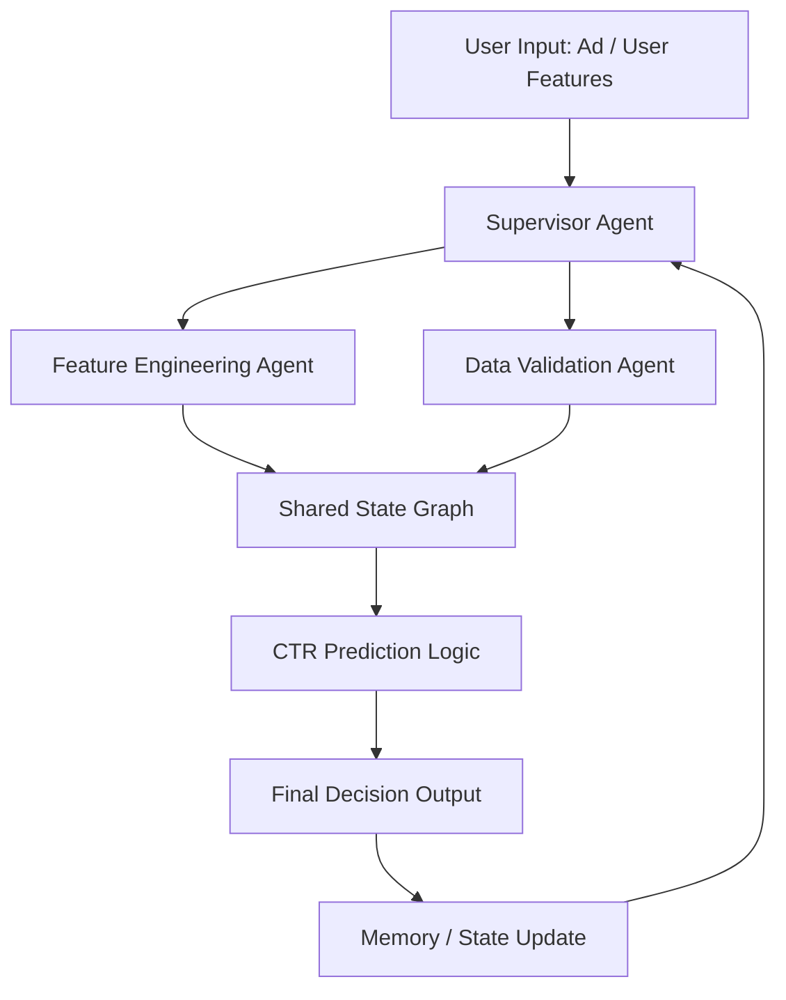

Below is a **portfolio-grade, FAANG-style README.md** upgrade for your repo. It includes:

* professional structure
* badges
* architecture diagram (Mermaid)
* clear problem framing
* system design clarity
* reproducible setup
* strong “engineering + ML + LLM systems” positioning

You can copy-paste this directly into your `README.md`.

---

# 🚀 Multi-Agent CTR Prediction System with LangGraph


---

## 🧠 Overview

This project implements a **multi-agent AI system for Click-Through Rate (CTR) prediction** using **LangGraph orchestration** and LLM-based reasoning.

Instead of relying on a single monolithic model, the system decomposes the problem into **specialized collaborating agents**, coordinated via a **stateful execution graph**.

It demonstrates how modern LLM systems can be structured like distributed software systems rather than simple pipelines.

---

## 🎯 Key Objectives

* Build a **multi-agent ML reasoning system**
* Use **LangGraph for stateful orchestration**
* Simulate real-world **CTR prediction workflows**
* Enable modular, extensible AI agent design
* Combine **ML + LLM reasoning + workflow graphs**

---

## 🏗️ System Architecture



### 🔍 Architecture Highlights

* **Supervisor Agent**

  * Routes tasks intelligently
  * Controls workflow execution

* **Feature Agent**

  * Extracts and transforms input features
  * Prepares ML-ready representation

* **Data Agent**

  * Validates, cleans, and checks consistency
  * Ensures data reliability

* **State Graph (LangGraph)**

  * Maintains shared execution state
  * Enables iterative reasoning loops

---

## ⚙️ Tech Stack

| Layer         | Technology               |
| ------------- | ------------------------ |
| Language      | Python 3.10+             |
| Orchestration | LangGraph                |
| LLM Framework | LangChain                |
| ML Tools      | NumPy, Pandas            |
| Execution     | Jupyter / Python scripts |
| Config        | dotenv                   |

---

## 📁 Project Structure

```
├── agents/
│   ├── supervisor_agent.py
│   ├── feature_agent.py
│   ├── data_agent.py
│
├── graph/
│   ├── workflow.py
│
├── utils/
│   ├── preprocessing.py
│
├── main.py
├── requirements.txt
├── .env.example
└── README.md
```

---

## 🚀 Getting Started

### 1️⃣ Clone Repository

```bash
git clone https://github.com/pranav1237/Build-a-Multi-Agent-CTR-Prediction-System-with-LangGraph.git
cd Build-a-Multi-Agent-CTR-Prediction-System-with-LangGraph
```

---

### 2️⃣ Create Environment

```bash
python -m venv venv
```

Activate:

**Windows**

```bash
venv\Scripts\activate
```

**Linux / Mac**

```bash
source venv/bin/activate
```

---

### 3️⃣ Install Dependencies

```bash
pip install -r requirements.txt
```

---

### 4️⃣ Configure Environment Variables

Create a `.env` file:

```bash
OPENAI_API_KEY=your_api_key_here
```

---

### 5️⃣ Run the System

```bash
python main.py
```

---

## 🔄 Workflow Execution

1. User submits CTR prediction request
2. Supervisor agent analyzes request
3. Feature agent processes input features
4. Data agent validates dataset consistency
5. LangGraph manages state transitions
6. CTR prediction logic executes
7. Final decision is returned
8. State is updated for future reasoning loops

---

## 📊 Use Cases

* Online advertising CTR prediction
* Recommendation systems
* Intelligent decision pipelines
* Multi-agent LLM research
* Workflow-based AI system design

---

## 🧪 Example Input

```json
{
  "user_age": 25,
  "device": "mobile",
  "ad_category": "tech",
  "time_of_day": "evening"
}
```

## 📤 Example Output

```json
{
  "ctr_prediction": 0.73,
  "decision": "show_ad",
  "confidence": 0.86
}
```

---

## 🧩 Design Principles

* 🔹 Modularity (each agent is independent)
* 🔹 Observability (state tracking via graph)
* 🔹 Extensibility (easy to add new agents)
* 🔹 Deterministic workflow control
* 🔹 LLM + ML hybrid reasoning

---

## 🔮 Future Improvements

* Add real ML model (XGBoost / DeepFM)
* Integrate vector database memory (FAISS / Pinecone)
* Add FastAPI deployment layer
* Add monitoring dashboard (LangSmith)
* Multi-user real-time inference API
* Streaming agent responses

---

## ⚠️ Important Notes

* Never commit `venv/` or large binaries
* Keep `.env` secure
* Designed for **research + prototyping**
* Not production-ready without API hardening

---

## 👨‍💻 Author

**Pranav**
GitHub: [https://github.com/pranav1237](https://github.com/pranav1237)

---

## ⭐ If you like this project

Consider:

* starring the repo ⭐
* forking it 🍴
* improving agent logic 🧠

---


<!-- Vercel production redeploy trigger -->
